The Cloud and Interactive Computing Group at the Texas Advanced Computing Center
was formed in March, 2017 with three mployees. Today, CIC is comprised of 
16 full-time staff specializing in a broad range of research software and 
devops engineering topics.  

<h2>Group Lead</h2>
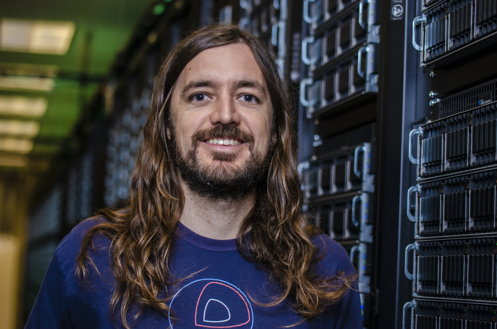

Joe Stubbs, PhD  
Research Associate, <i>Principal Investigator</i>; <a href="https://www.tacc.utexas.edu/about/directory/joe-stubbs">Staff Bio</a>

 

<h2>Project Manager</h2>

Mary John 
Senior Project Manager, <a href="https://www.tacc.utexas.edu/about/directory/mary-john">Staff Bio</a>

 

<h2>Researcher Engineers</h2>

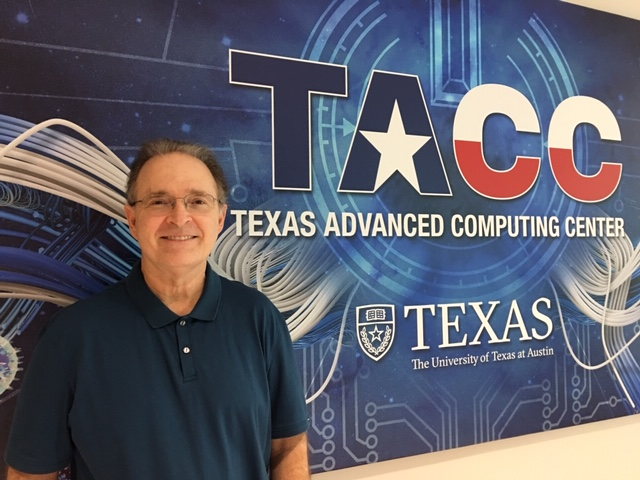

Steve Black, PhD  
Engineering Scientist, <a href="https://www.tacc.utexas.edu/about/directory/steve-black">Staff Bio</a>

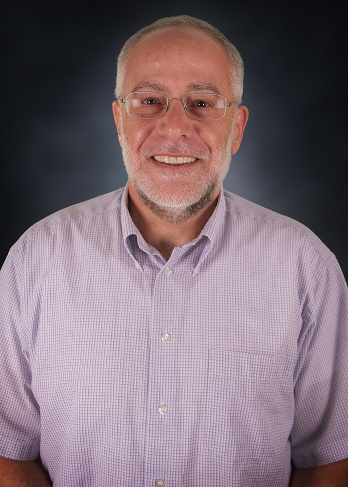

Richard Cardone, PhD  
Research Associate, <a href="https://www.tacc.utexas.edu/about/directory/richard-cardone">Staff Bio</a>

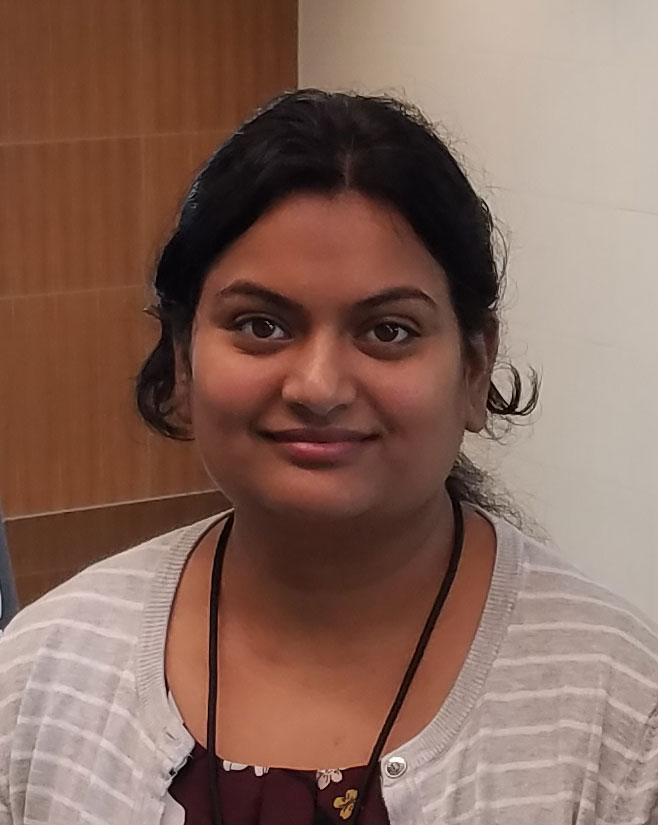

Anagha Jamthe, PhD 
Research Engineering Scientist Associate, <a href="https://www.tacc.utexas.edu/about/directory/anagha-jamthe">Staff Bio</a> 

Joe Meiring, PhD 
Research Engineering Scientist Associate, <a href="https://www.tacc.utexas.edu/about/directory/joseph-meiring">Staff Bio</a> 

Smruti Padhy, PhD 
Research Engineering Scientist Associate, <a href="https://www.tacc.utexas.edu/about/directory/smruti-padhy">Staff Bio</a> 

 

<h2>Software Engineers</h2>

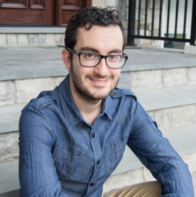

Elias Chalhoub 
Python Developer, <a href="https://www.tacc.utexas.edu/about/directory/elias-chalhoub">Staff Bio</a> 

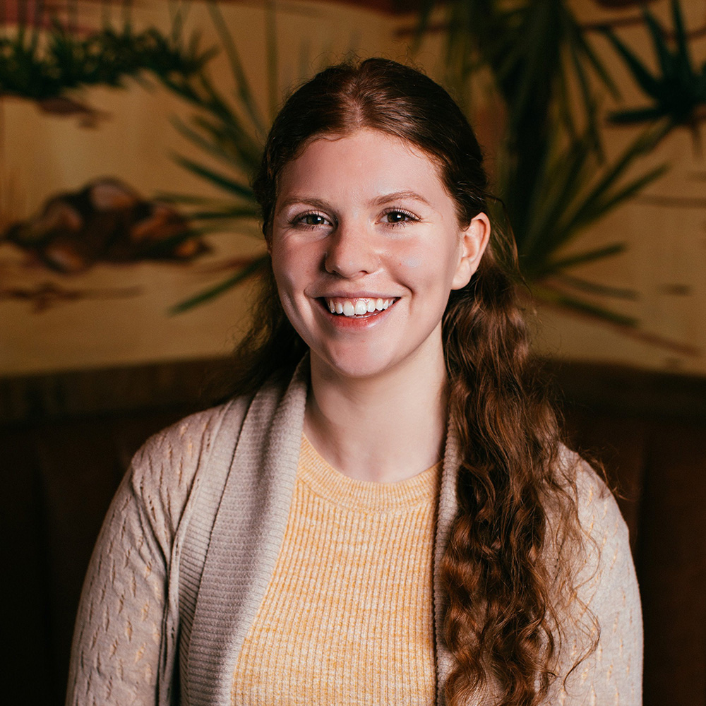

Brandi Kuritz 
Python Developer, <a href="https://www.tacc.utexas.edu/about/directory/brandi-kuritz">Staff Bio</a> 

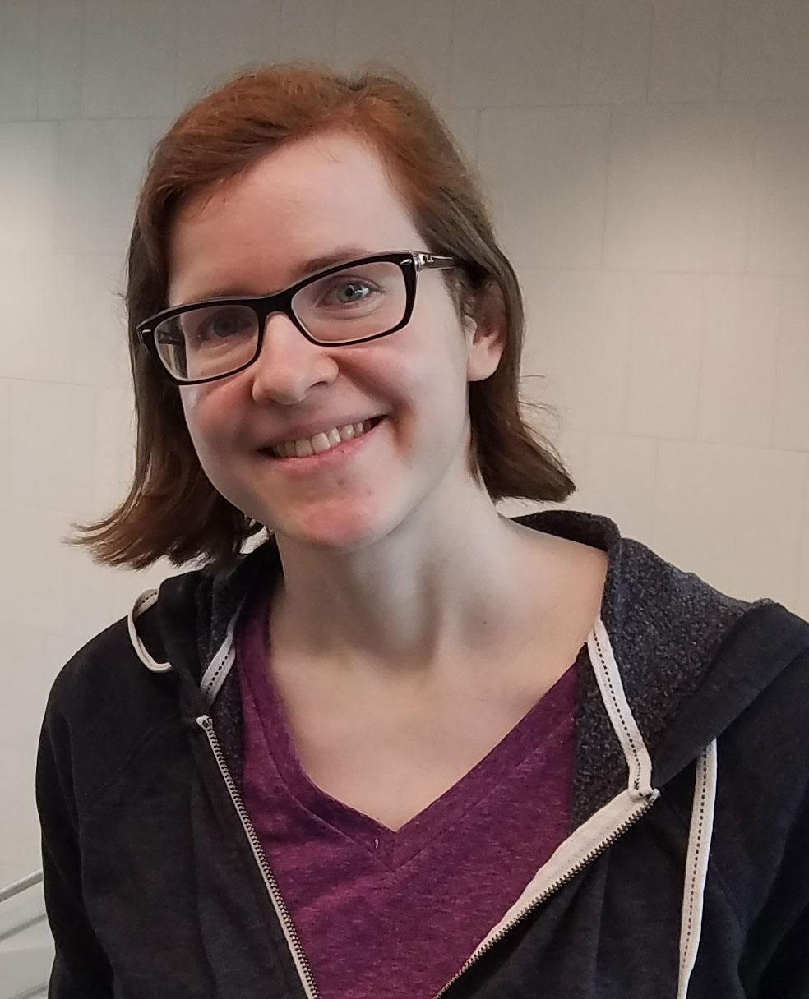

Julia Looney 
Python Developer, <a href="https://www.tacc.utexas.edu/about/directory/julia-looney">Staff Bio</a> 

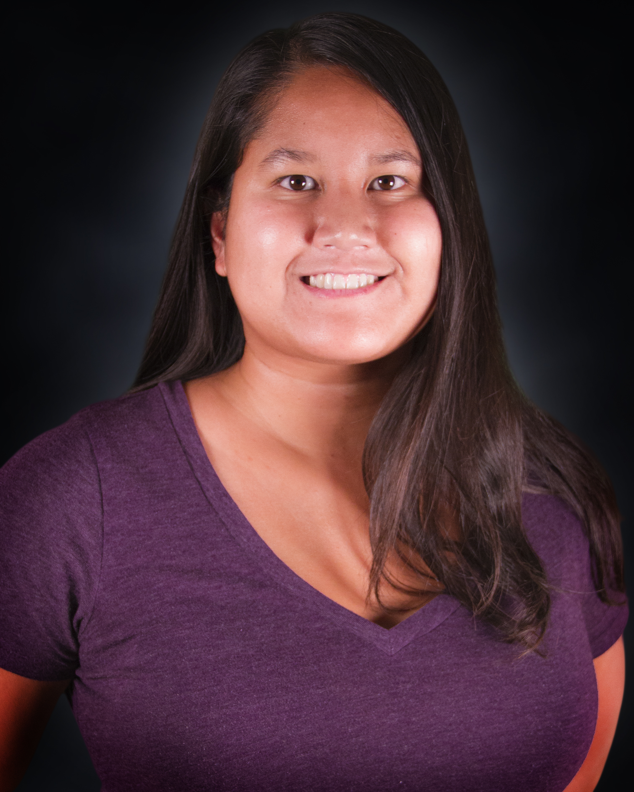

Marjo Poindexter 
Python Developer, <a href="https://www.tacc.utexas.edu/about/directory/marjo-poindexter">Staff Bio</a> 

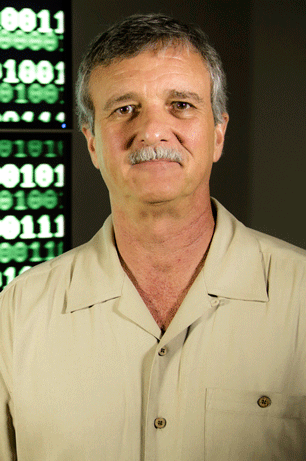

Steve Terry 
Senior Java Engineer, <a href="https://www.tacc.utexas.edu/about/directory/steve-terry">Staff Bio</a> 

 

<h2>DevOps Engineers</h2>

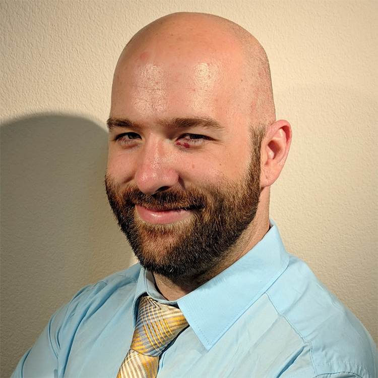

Alexander Barnes 
Devops Engineer, <a href="https://www.tacc.utexas.edu/about/directory/alexander-barnes">Staff Bio</a> 

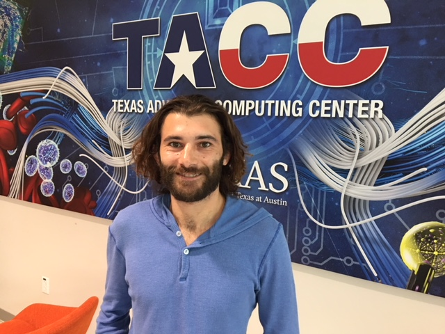

Francois Halback 
Devops Engineer, <a href="https://www.tacc.utexas.edu/about/directory/francois-halbach">Staff Bio</a> 

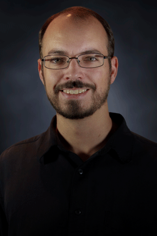

Cody Hammock 
Senior Devops Engineer, <a href="https://www.tacc.utexas.edu/about/directory/cody-hammock">Staff Bio</a> 

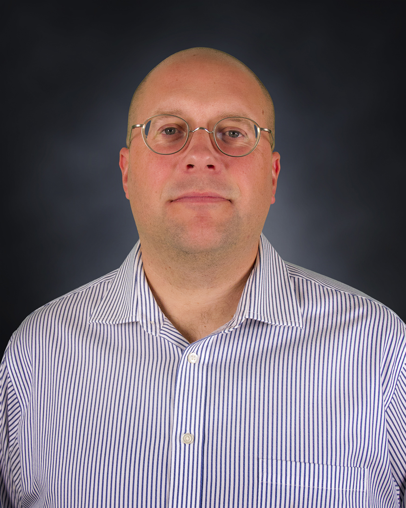

Mike Packard 
Senior Devops Engineer, <a href="https://www.tacc.utexas.edu/about/directory/mike-packard">Staff Bio</a> 

 

<h2>Support Specialists</h2>

Alex Fields 
Support Specialist, <a href="https://www.tacc.utexas.edu/about/directory/alexander-fields">Staff Bio</a> 

 
<h2>Students</h2>
The Cloud & Interactive Computing Group regularly sponsors and mentors students as part of 
Research Experience for Undergraduate (REU) projects funded by CIC grants and
affiliated funding sources.

<h3>Current Students</h3>

Christian Garcia - Abaco REU Student; Spring, 2019 to present.

 
<h3>Previous Students</h3>

Rose Shapi - SGCI REU Student; Summer, 2019.

Gilbert Curbelo - SGCI REU Student; Summer, 2019.

John Lee - JetStream Professional Internship student; Summer, 2019.

Kreshel Nguyen - Abaco REU student; Spring - Summer, 2019.

Ke’Darius Whitley - SGCI REU Student; Summer, 2018.

Tatyana Mathews - IPT REU Student; Summer, 2017.

