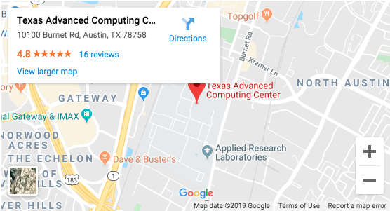

CIC provides consulting and support services for projects in both an official
and unofficial capacity. Our support specialist monitors our official
slack channel Monday through Friday, 8 am - 5 pm.

<ul>
  <li>Office Slack channel: <a href="https://tacc-cloud.slack.com">TACC Cloud Sack</a>; New User? <a href="http://bit.ly/join-tapis">Join our Slack Team</a> </li>
  <li>Submit a ticket (requires TACC login): <a href="https://portal.tacc.utexas.edu/tacc-consulting/-/consult/tickets/create">TACC User Portal</a> </li>
</ul>

<h3>Visit Us</h3>
Interested in collaborating? We are located in the Advanced Computing Building
on the Pickle Research Campus of the University of Texas, in Austin:

